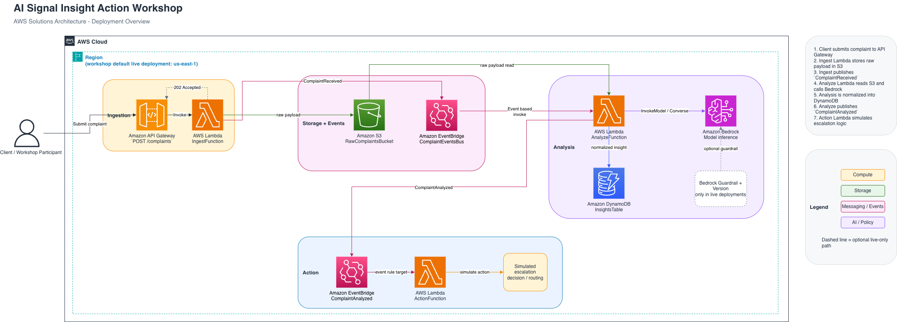

# AI Signal Insight Action Workshop

This repository is a small event-driven AWS workshop that turns a customer complaint into:

1. a raw submission stored in S3
2. an immediate complaint state record persisted in DynamoDB
3. a structured analysis produced by a Lambda function
4. a simulated downstream action decision
5. a queryable complaint snapshot returned by API

It is designed to be easy to demo locally with AWS SAM and easy to deploy into AWS for a hands-on workshop.

## What Participants Learn

- how an API-triggered workflow fans out through EventBridge
- how to separate ingest, analysis, and action responsibilities
- how to use deterministic mock AI output for workshops
- how to switch from mock mode to live Amazon Bedrock analysis
- how a model adapter can isolate provider-specific model logic
- how guardrails and validation affect downstream processing

## Architecture

```text
POST /complaints
  -> IngestFunction
  -> 202 Accepted with generated complaintId
  -> S3 raw complaint record
  -> EventBridge: ComplaintReceived
  -> AnalyzeFunction
  -> Amazon Bedrock analysis (guardrails in live mode)
  -> DynamoDB insights record
  -> EventBridge: ComplaintAnalyzed
  -> ActionFunction
  -> simulated escalation decision
GET /complaints/{complaintId}
  -> QueryFunction
  -> DynamoDB complaint snapshot
```



The diagram highlights the main event-driven write path. The new query path is the `GET /complaints/{complaintId}` flow described in the text above.

## Repository Map

```text
.
├── README.md
├── template.yaml
├── samconfig.toml
├── src/
│   ├── ingest/
│   ├── analyze/
│   ├── action/
│   └── query/
├── events/
│   ├── ingest-api.json
│   ├── ingest-api-sensitive.json
│   ├── analyze-event.json
│   ├── action-event.json
│   └── query-api.json
├── docs/
│   ├── participant-guide.md
│   ├── instructor-guide.md
│   ├── troubleshooting.md
│   └── costing.md
├── specs/
└── tasks/
```

## Prerequisites

- AWS CLI configured with credentials for the target account
- AWS SAM CLI installed
- Docker running for `sam local` commands
- Python 3.12

Verify the basics:

```bash
aws sts get-caller-identity
sam --version
docker --version
python3 --version
```

## Quick Start

### Local Workshop Run

Build and start the local API:

```bash
sam build
sam local start-api
```

In another terminal, send a complaint:

```bash
API_BASE_URL="http://127.0.0.1:3000"
POST_API_URL="$API_BASE_URL/complaints"

curl -s -X POST "$POST_API_URL" \
  -H "Content-Type: application/json" \
  -d '{
    "channel":"email",
    "message":"Your support team ignored my issue for three days and I still cannot access my account."
  }'
```

Expected response:

```json
{"status":"accepted","complaintId":"cmp-<uuid-v4>"}
```

Use the returned `complaintId` to query the complaint later:

```bash
curl -s "$API_BASE_URL/complaints/<complaintId>"
```

### Direct Function Invocations

These are useful when you want to test one function in isolation instead of the whole flow:

```bash
sam local invoke IngestFunction --event events/ingest-api.json
sam local invoke IngestFunction --event events/ingest-api-sensitive.json
sam local invoke AnalyzeFunction --event events/analyze-event.json
sam local invoke ActionFunction --event events/action-event.json
sam local invoke QueryFunction --event events/query-api.json
```

## Deploy to AWS

First deployment:

```bash
sam deploy --guided
```

Subsequent deployments:

```bash
sam build
sam deploy
```

Fetch stack outputs after deployment:

```bash
aws cloudformation describe-stacks \
  --stack-name ai-signal-insight-action-workshop \
  --query "Stacks[0].Outputs[].[OutputKey,OutputValue]" \
  --output table
```

Set the deployed API URL:

```bash
API_BASE_URL="<your-api-base-url>"
POST_API_URL="$API_BASE_URL/complaints"
```

## Deployment Profiles

`samconfig.toml` includes several workshop-friendly profiles:

- `default`: live Bedrock plus stack-managed guardrail
- `mock`: deterministic mock analysis for repeatable demos
- `dev`: separate mock-mode dev stack
- `failure`: forced analyzer failure path
- `invalid`: forced invalid model-output path

Examples:

```bash
sam build
sam deploy --config-env mock
sam deploy --config-env failure
sam deploy --config-env invalid
```

## Bedrock Notes

- Local runs default to mock mode because `UseMockBedrock` defaults to `true` in [template.yaml](template.yaml).
- The checked-in default deploy profile uses live Bedrock in `us-east-1`.
- Live Bedrock deployments create a workshop guardrail and guardrail version in the stack.
- You still need model access enabled in Amazon Bedrock for the same account and region before live analysis will work.

The current default model ID is `global.anthropic.claude-haiku-4-5-20251001-v1:0`.

## What to Look For

- `IngestFunction` validates the request, generates the complaint ID, stores the raw payload, creates the initial DynamoDB state item, and publishes `ComplaintReceived`.
- `AnalyzeFunction` loads the raw complaint, validates AI output, updates the complaint state item to `ANALYZED`, and publishes `ComplaintAnalyzed`.
- `ActionFunction` applies simple escalation rules, persists the simulated action outcome, and advances the complaint state item to `ACTIONED`.
- `GET /complaints/{complaintId}` returns the current complaint snapshot from DynamoDB.

## Documentation Guide

- Participant walkthrough: [docs/participant-guide.md](docs/participant-guide.md)
- Instructor runbook: [docs/instructor-guide.md](docs/instructor-guide.md)
- Troubleshooting: [docs/troubleshooting.md](docs/troubleshooting.md)
- Cost and cleanup notes: [docs/costing.md](docs/costing.md)

## Cleanup

When you are done, delete the workshop stack so costs stop accumulating:

```bash
sam delete --stack-name ai-signal-insight-action-workshop
```

If stack deletion is blocked by a non-empty bucket, use the cleanup steps in [docs/costing.md](docs/costing.md).
